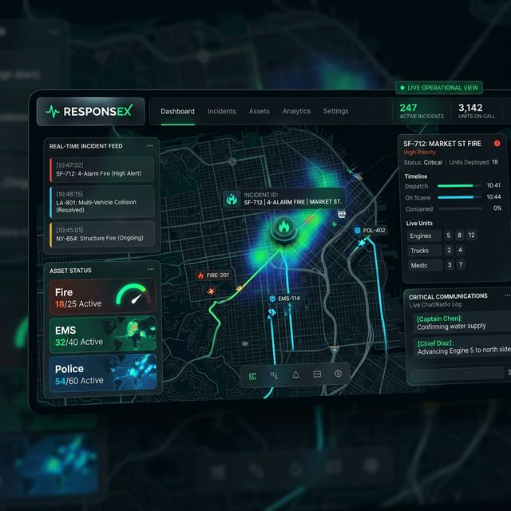
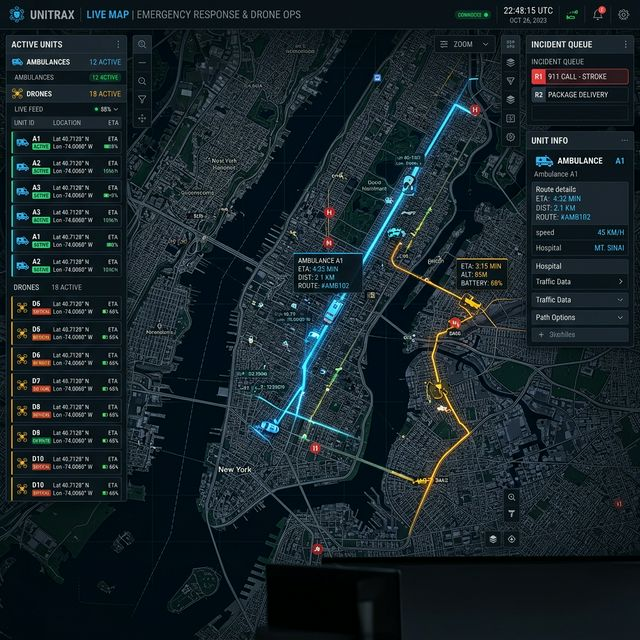
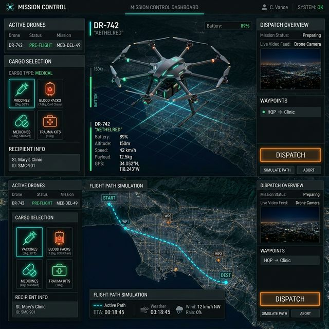
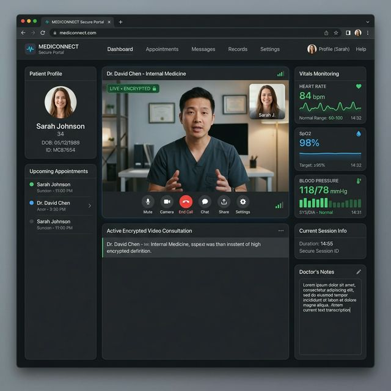

# PROJECT LINK - https://smart-care-emergency.vercel.app/

# ⚕ SmartCare Emergency Response Platform

SmartCare is a high-stakes, real-time emergency response platform designed to connect patients to medical assets (Ambulances, Doctors, and Drones) in seconds. Built with a premium design language, the platform offers a unified command center for emergency logistics and analytics.

## 🚀 Key Features

### 1. Unified Emergency Dashboard
The core mission control for patients and responders. Trigger an SOS to activate a multi-asset response pipeline with live ETA tracking and status logs.

### 2. Live Asset Tracking
A full-screen interactive map powered by **Leaflet.js** and **CartoDB**. Track ambulances and drones in real-time as they navigate toward the patient with dynamic path-finding.

### 3. Drone Dispatch & Logistics
Mission control for autonomous medical supply delivery. Select cargo (Medicines, AEDs, Emergency Kits) and dispatch drones to specific map coordinates with flight path simulation.

### 4. Telemedicine Portal
Encrypted video consultation platform with integrated real-time patient vitals monitoring (Heart Rate, SpO2, Blood Pressure, Temperature).

### 5. Admin Impact Dashboard
Comprehensive analytics suite for platform performance. Features interactive **Chart.js** visualizations, KPI counter animations, and a live platform activity feed.

---

## 💅 Premium UI/UX Polish
- **Smooth Page Transitions**: Dark fade-out/in transitions for a seamless SPA feel.
- **Micro-Animations**: Spring-based physics (`cubic-bezier`) for all buttons and card interactions.
- **Interactive Ripples**: Modern feedback on all clickable elements.
- **Glassmorphism Design**: High-contrast, futuristic dark theme with blurred overlays.

---

## 🛠️ Technical Stack
- **Frontend**: Vanilla HTML5, CSS3, JavaScript (ES6+)
- **Mapping**: [Leaflet.js](https://leafletjs.com/)
- **Charts**: [Chart.js](https://www.chartjs.org/)
- **Telemedicine**: [Jitsi Meet API](https://jitsi.org/jitsi-meet/)
- **Animations**: CSS Keyframes, Intersection Observer API

---

## 🚦 Getting Started
1. Clone the repository to your local machine.
2. Ensure you have a local web server (e.g., `npx serve .` or Live Server).
3. Open `index.html` to enter the landing page.
4. Explore the platform using the navigation bar.

---
**Every second counts. SmartCare.**
